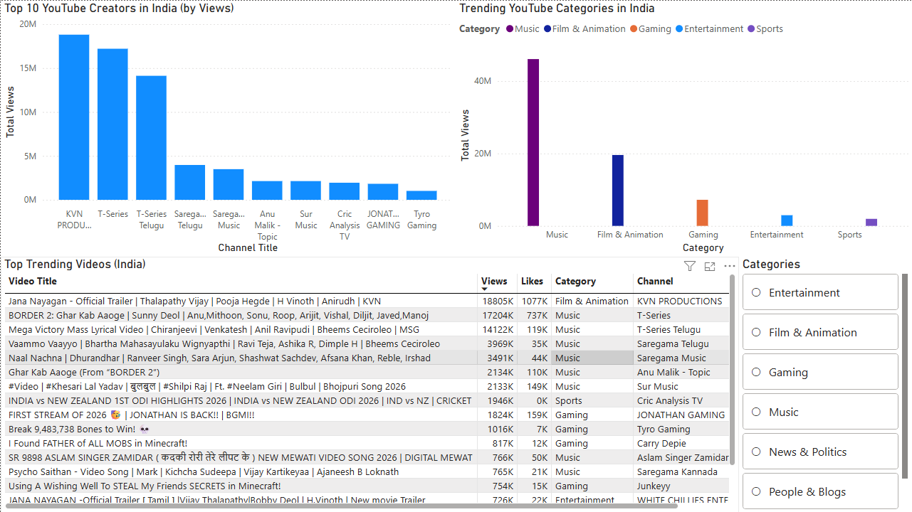

# YouTube Trending Data Pipeline (India)

## 📌 Project Overview
This project is an **end-to-end data engineering pipeline** that extracts daily trending YouTube video data for **India**, processes and aggregates it, and prepares it for **business intelligence dashboards**.

The project demonstrates real-world data engineering practices such as API-based ingestion, layered data architecture, data cleaning, aggregation, and BI integration.

---

## 🏗 Architecture

YouTube Data API (India)  
↓  
Raw Data Layer (CSV)  
↓  
Processed Data Layer (Cleaned & Enriched)  
↓  
Aggregated Data Layer (Analytics Tables)  
↓  
Power BI Dashboard  

---

## 🛠 Tech Stack

- **Language:** Python  
- **IDE:** VS Code  
- **API:** YouTube Data API v3  
- **Data Processing:** Pandas  
- **Storage:** CSV (local filesystem)  
- **Dashboard:** Power BI  
- **Version Control:** Git & GitHub  

---

## 📂 Project Structure
 
```text
 youtube_trending_pipeline/
│
├── config/
│ ├── config.py
│ ├── video_categories.json
│
├── scripts/
│ ├── extract.py
│ ├── transform.py
│ └── aggregate.py
│
├── data/
│ ├── raw/
│ ├── processed/
│ └── aggregated/
│
├── dashboard/
│ └── dashboard.png
│
├── requirements.txt
├── .gitignore
└── README.md
```

## 🔄 Pipeline Stages

### 1️⃣ Extraction
- Uses the YouTube Data API v3
- Fetches **daily trending videos for India**
- Stores raw data in CSV format

Run:
```bash
python -m scripts.extract
```
### 2️⃣ Transformation
- Enforces schema and data types
- Handles missing values
- Maps category_id to readable category names
- Outputs cleaned data to the processed layer

Run:
```bash
python -m scripts.transform
```
### 3️⃣ Aggregation
Creates analytics-ready datasets:
- Top YouTube creators by total views
- Trending categories
- Top trending videos

Run:
```bash
python -m scripts.aggregate
```

### 📊 Dashboard (Power BI)
The Power BI dashboard provides:
- Top YouTube creators in India by total views
- Trending video categories
- Most viewed trending videos
- Category-based filtering for analysis

The dashboard automatically refreshes when the pipeline is re-run and data is refreshed in Power BI.

### Dashboard Preview


### 🚀 How to Run the Project
1. Install Dependencies
```bash
pip install -r requirements.txt
```
2. Configure API Key
```bash
YOUTUBE_API_KEY = "YOUR_API_KEY_HERE"
REGION_CODE = "IN"
```
3. Execute Pipeline
```bash
python -m scripts.extract
python -m scripts.transform
python -m scripts.aggregate
```

### 🔐 Data & Security Notes
- API keys are not committed to GitHub
- Raw, processed, and aggregated data files are ignored using .gitignore
- Only source code and configuration files are version-controlled

### 📈 Future Enhancements
- Historical trend analysis (day-over-day growth)
- Database storage (PostgreSQL)
- Scheduling using cron or Task Scheduler
- Cloud deployment (AWS / GCP)
- Advanced dashboard metrics and design improvements

### 👤 Author
Saikat Samanta